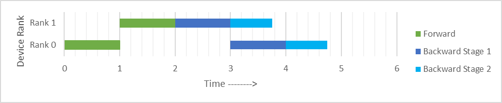

# 2 Stage BackPropagation

### Experiment 1 (Ignore)
Exp1 looks at the effect of sequential layers with jacobains that are constant for the batch, such is the case for sequential Dense and Conv layers. The model multiplies intermediate jacobians to allow an increase in parallelism. The use case of this is very niche.

### Experiment 2
The best way to explain is with an example:

Our model Is a basic MLP and it’s spilt across 2 devices via model parallelism:

$$\textcolor{red}{z^0=w^0 x+b^0}$$
$$\textcolor{red}{a^0=\text{ReLU}(z^0)}$$
$$\textcolor{red}{z^1=w^1 a^0+b^1}$$
$$\textcolor{red}{a^1=\text{ReLU}(z^1)}$$
$$\textcolor{cyan}{z^2=w^2 a^1+b^2}$$
$$\textcolor{cyan}{a^2=\text{ReLU}(z^2)}$$
$$\textcolor{cyan}{z^3=w^3 a^2+b^3 \qquad z^3=\hat{y}}$$
$$\textcolor{cyan}{L(\hat{y}, y)}$$

Where $\textcolor{red}{\text{red}}$ is processed on $\textcolor{red}{\text{rank 0}}$ and $\textcolor{cyan}{\text{cyan}}$ is processed on $\textcolor{cyan}{\text{rank 1}}$ and Where $x$ is the input values, $\hat{y}$ is the predicted values and $y$ is the true value used to compare with the predicted values.

The training process is made up of 3 steps. 1. Forward Pass 2. Backward Pass 3. Parameter Update.

The forward pass is the process of passing an input through the model and then the model output to the Loss function $L$, storing intermediates as you propagate through each layer sequentially.

The backward pass is the process used to calculate $\frac{\partial L}{\partial v^l}$ where $v^l$ is the parameters in layer $l$, this is done via the chain rule for example:

$$
\frac{\partial L}{\partial w^3} = 
\frac{\partial L}{\partial z^3} \times \frac{\partial z^3}{\partial w^3} 
$$
$$
\frac{\partial L}{\partial w^2} = 
\frac{\partial L}{\partial z^3} \times \frac{\partial z^3}{\partial a^2} \times
\frac{\partial a^2}{\partial z^2} \times \frac{\partial z^2}{\partial w^2} 
$$

Finally, once all the gradients have been calculated you update each parameter accordingly with an SGD based algorithm. 

As we backward pass through each layer, each layer gets passed $\frac{\partial L}{\partial z^l}$ and computes 1 or 2 outputs. $\frac{\partial L}{\partial z^{l-1}}$ which is passed in as the input to the backward pass of the next layer and if the model has any trainable parameters ($v$) we calculate $\frac{\partial L}{\partial v^l}$ used for the parameter update.

As our model is split across 2 devices, rank 0 computes from $x$ to $a^1$,then send $a^1$ to rank 1 for which rank 1 proceeds to computes $a^1$ to $z^3$ and then the loss ($L$). 

For the backward pass, rank 1 computes $\frac{\partial L}{\partial z^{3}}$ to $\frac{\partial L}{\partial a^{1}}$ and all intermediate parameter gradients as you pass through each layer, then sends $\frac{\partial L}{\partial a^{1}}$ to rank 0, for which rank 0 proceeds to compute $\frac{\partial L}{\partial a^{1}}$ to $\frac{\partial L}{\partial v^{0}}$ with all intermediate parameter gradients. 

Then each rank can upgrade its local parameters in parallel.

Visually this looks like this:

As you can see there is no compute overlap. The goal of out technique is to start the compute of the backward pass on rank 0 as fast as possible.

We do this by not computing $\frac{\partial L}{\partial v^l}$ on rank 1 until compute starts on rank 0. We split the backward pass into 2 stages. 

During the stage 1 $\frac{\partial L}{\partial z^l}$ is passed into the layer $l$, it is stored in memory for use in stage 2 on the condition that the layer has trainable parameters. Next $\frac{\partial L}{\partial z^{l-1}}$ is calculated and passed to the next layer of the backward pass.

Stage 2 starts once stage 1 has finished on that device. For each layer in **parallel** $\frac{\partial L}{\partial z^l}$ is loaded from memory and $\frac{\partial L}{\partial v^l}$ is calculated for each layer accordingly.

Visually this new technique looks like this:

This new technique can be less memory efficient based on the operation taking place in each layer, if the number of elements in the tensor of $\frac{\partial L}{\partial z^l}$ is greater than $\frac{\partial L}{\partial v^l}$ which is the case for operations like Conv2D.

Unfortunately, Pytorch autograd doesn’t give us an easy way to implement this so we must implement backpropagation from scratch.

### Experiment 3
Exp 3 looks into the technique introduced in Exp 2 but on top of pipeline parallelism to further increase parallelism, and provide a more realistic use case.

### Experiment 4
Exp 4 goes a step above Exp 3 by combining the pipeline parallelism with tensor parallelism and and data parallelism to replicate an even more realistic use case.
